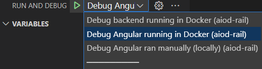
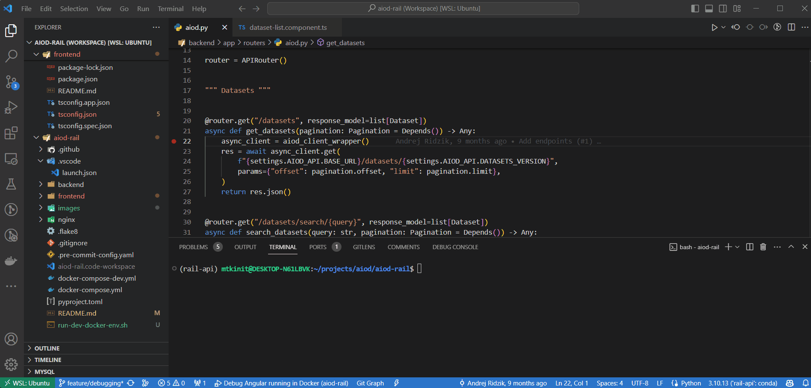

# AIoD - RAIL (Research and Innovation AI Lab)
RAIL service is a tool that allows AI practitioners to explore and use AI assets directly in AIoD.
RAIL is developed within the <a href="https://ai4europe.eu" target="_blank">AI4Europe project</a> as one of the core services of the <a href="https://aiod.eu" target="_blank">AI on Demand platform.</a>

More extensively, RAIL:
* Is a web application
* … that enables **AI practitioners**
* … to **work with AIoD AI Assets** (explore, search, compare, …)
* … and **create experiments** that are reproducible and reusable
* … that are **executable directly in the AIoD platform** supported by its infrastructure
* … and that **make use of AIoD AI Assets**.

IMPORTANT: RAIL is a service built on top of [AIoD API](https://github.com/aiondemand/AIOD-rest-api)
and relies heavily on its contents and functionalities.

## Installation
This repository consists of two main components - **frontend** and **backend** applications,
served by `nginx` configured as a reverse proxy (for more details see [nginx/default.conf](nginx/default.conf)).
Each of these components can be built and deployed individually (see the corresponding sub-folders [frontend](frontend) and [backend](backend)).
However, it is recommended to deploy RAIL as a whole using `Docker Compose` from the root directory.

Running command
```shell
docker compose up -d
```
starts the backend REST API application (FastAPI) together with its underlying database (MongoDB)
and the frontend web application (Angular).

Note: Some additional changes to file [docker-compose.yml](docker-compose.yml) might be needed
in order to change the default ports, etc.

### Configuration
* **Backend** - It is _mandatory_ to configure environment variables in file `backend/.env`.
  See the section "_Setup->Using docker compose_" in the corresponding [README](backend/README.md) file for more details.
* **Frontend** - There are some environments created and can be selected in the [docker-compose.yml](docker-compose.yml) file
  by a build argument `PROFILE` of the `frontend-app`. Update one of the existing ones to suit your specific needs.

## Authentication
Some of the functionality is accessible only for authenticated users.
Authentication server needs to be correctly setup and referenced in the _frontend_ and _backend_ configuration files.
The current setup relies on Keycloak deployed as part of [AIoD API](https://github.com/aiondemand/AIOD-rest-api).

## Usage
Following the installation instructions above, the web application may be reached at `127.0.0.1:80`.
Documentation of the underlying backend REST API is automatically generated and can be viewed at `127.0.0.1:80/api/docs`.

## Development and debugging
For development purposes, we recommend running RAIL's development docker containers (docker-compose) and then attach to the applications running inside. This helps to ensure that all developers develop in the same environment.

To start development and debugging, follow these steps:
1. Create development `.env-dev` file in the Backend root folder. It must define all variables the `.env` file defines.
1. Start the images either by running [`run-dev-docker-env.sh`](./run-dev-docker-env.sh) or by running the following command from the root of the project:   
    * ```bash 
      docker-compose -f docker-compose.yml -f docker-compose-dev.yml up -d --build
      ```
1. Attach to the application.
    * For **Visual Studio Code**, there are a [`.vscode/launch.json`](.vscode/launch.json) configuration file in the root directory. In the *Run and Debug* menu, you should see:
        * 

This gif shows how to start development containers and attach a debugger in Visual Studio Code:


Under the hood:
* **Frontend** starts the development server (`ng serve ...`).
* **Backend** utilizes the `debugpy` utility (`debugpy ... -m uvicorn ...`). The debug server listens on *0.0.0.0:5678*.

### Notes
When you install a new package (Python lib or an NPM package), you need to restart the dev containers.

For better development experience, we recommend installing the local dev environments and libraries. Depending on your IDE, this will allow for features like autocomplete.
* **Frontend**
    * Install node and npm package manager.
    * Install all the dependencies: `npm ci`
* **Backend**
    * [optional] Create a Python virtual environment, conda environment or equivalent.
    * Install all the dependencies: `pip install --no-cache-dir --upgrade -r requirements.txt`


## Contact
For any questions please contact the maintainers:
* Martin Tamajka ([martin.tamajka@kinit.sk](mailto:martin.tamajka@kinit.sk))
* Andrej Ridzik ([andrej.ridzik@kinit.sk](mailto:andrej.ridzik@kinit.sk))
