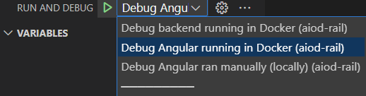
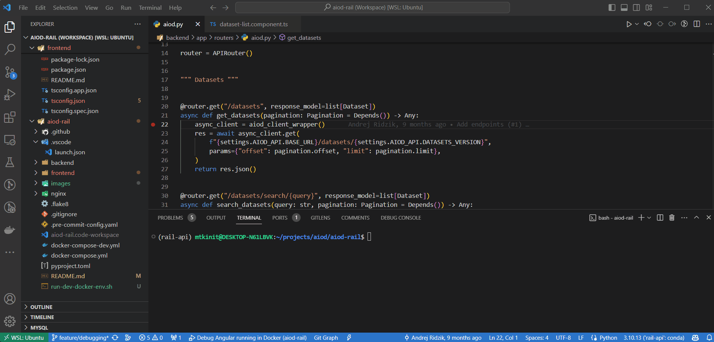

# AIoD - RAIL (Research and Innovation AI Lab)
RAIL service is a tool that allows AI practitioners to explore and use AI assets directly in AIoD.
RAIL is developed within the <a href="https://ai4europe.eu" target="_blank">AI4Europe project</a> as one of the core services of the <a href="https://aiod.eu" target="_blank">AI on Demand platform.</a>

More extensively, RAIL:
* Is a web application
* … that enables **AI practitioners**
* … to **work with AIoD AI Assets** (explore, search, compare, …)
* … and **create experiments** that are reproducible and reusable
* … that are **executable directly in the AIoD platform** supported by its infrastructure
* … and that **make use of AIoD AI Assets**.

IMPORTANT: RAIL is a service built on top of [AIoD API](https://github.com/aiondemand/AIOD-rest-api)
and relies heavily on its contents and functionalities.

## Deployment
This repository consists of two main components - **frontend** and **backend** applications,
served by `nginx` configured as a reverse proxy (for more details see [nginx/default.conf](nginx/default.conf)).
Each of these components can be built and deployed individually (see the corresponding sub-folders [frontend](frontend) and [backend](backend)).
However, it is recommended to deploy RAIL as a whole using `Docker Compose` from the root directory.

Running command
```shell
docker compose up -d
```
starts the backend REST API application (FastAPI) together with its underlying database (MongoDB)
and the frontend web application (Angular).

Note: Some additional changes to file [docker-compose.yml](docker-compose.yml) might be needed
in order to change the default ports, etc.

### Dependencies
In order for RAIL to work properly, you may need to deploy additional AIoD services or other misc services RAIL depends on, especially when you wish to build the entire AIoD ecosystem from scratch.
Unless you utilize and point RAIL to already existing official AIoD services, you need to deploy the following dependencies first for RAIL to work:
- [AIoD Metadata Catalogue](https://github.com/aiondemand/AIOD-rest-api) for accessing AIoD assets
  - *Keycloak auth service is a part of this service*
- [AIoD MyLibrary](https://github.com/aiondemand/AIOD-mylibrary-backend) for accessing your bookmarked AIoD assets
- [AIoD Enhanced Interaction](https://github.com/aiondemand/aiod-enhanced-interaction) for performing Enhanced Search and Chatbot functionality
- [REANA](https://docs.reana.io/) for executing experiments

If you decide to utilize official AIoD services, you need to contact AIoD team to create credentials for most of these services. More specifically you would need the following credentials for your own RAIL instance to work with official AIoD platform:
- AIoD Keycloak credentials (new clients setup for RAIL frontend and backend)
- REANA credentials


### Configuration
* **Backend** - It is _mandatory_ to configure environment variables in file `backend/.env`.
  See the section "_Deployment_" in the corresponding [README](backend/README.md) file for more details.
* **Frontend** - It is _mandatory_ to configure frontend in `frontend/src/app/environments/environment.production.ts` granted you use the `prod` value for `PROFILE` Docker argument (that you can change in `docker-compose.yml`). See the section "_Deployment_" in the corresponding [README](frontend/README.md) file for more details.


### Deployment checklist
- Unless you use official AIoD services, deploy additional dependencies and services RAIL relies on specified above
- Configure backend and frontend components accordingly. For more information, check their respective README files
- Perform any additional changes to the main `docker-compose.yml` file you deem necessary for your setup
- Execute the command: `docker compose up -d --build`


## Development and debugging
For development purposes, we recommend running RAIL's development docker containers (docker compose) and then attach to the applications running inside. This helps to ensure that all developers develop in the same environment.

To start development and debugging, follow these steps:
1. Create development `.env-dev` file in the Backend root folder. It must define all variables the `.env` file defines.
1. Start the images either by running [`run-dev-docker-env.sh`](./run-dev-docker-env.sh) or by running the following command from the root of the project:
    * ```bash
      docker compose -f docker-compose.yml -f docker-compose-dev.yml up -d --build
      ```
1. Attach to the application.
    * For **Visual Studio Code**, there are a [`.vscode/launch.json`](.vscode/launch.json) configuration file in the root directory. In the *Run and Debug* menu, you should see:
        * 

This gif shows how to start development containers and attach a debugger in Visual Studio Code:


Under the hood:
* **Frontend** starts the development server (`ng serve ...`).
* **Backend** utilizes the `debugpy` utility (`debugpy ... -m uvicorn ...`). The debug server listens on *0.0.0.0:5678*.

### Notes
When you install a new package (Python lib or an NPM package), you need to restart the dev containers.

Current setup doesn't support Frontend hot reload (--watch). You need to refresh your browser after every change.

For better development experience, we recommend installing the local dev environments and libraries. Depending on your IDE, this will allow for features like autocomplete.
* **Frontend**
    * Install node and npm package manager.
    * Install all the dependencies: `npm ci`
* **Backend**
    * [optional] Create a Python virtual environment, conda environment or equivalent.
    * Install all the dependencies: `pip install --no-cache-dir --upgrade -r requirements.txt`


## Contact
For any questions please contact the maintainers:
* Martin Tamajka ([martin.tamajka@kinit.sk](mailto:martin.tamajka@kinit.sk))
* Andrej Ridzik ([andrej.ridzik@kinit.sk](mailto:andrej.ridzik@kinit.sk))
